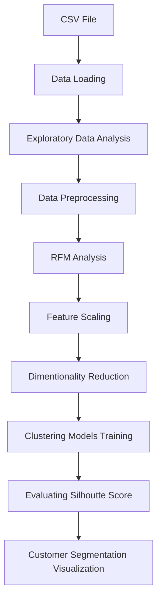

#  📚 E-Commerce Customer Segmentation and Prediction

[](https://www.python.org/downloads/)
[](https://streamlit.io/)
[](https://code.visualstudio.com/download)

<p align="center">
  
</p>

## 🌟 Project Description

This project aims to enhance marketing strategies and customer retention for an e-commerce company by gaining a deeper understanding of their customer base based on their purchasing pattern.The goal is to develop a robust customer segmentation model and a predictive classifier to categorize customers based on their purchasing patterns, enabling the company to tailor marketing strategies, improve customer retention, and optimize inventory management.

## 🎯 Features
- 📊 Detail (Recency Frequency Monetary) RFM Analysis
- ⚙️ Feature Engineering
- 📈 Analyzing Different Models

## 🛠️ Technical Architecture

### Component Stack


## Installation & Setup

### 1. Environment Setup

```bash
# Create virtual environment
python -m venv venv

# Activate environment
# For Windows
.\venv\Scripts\activate

# Install dependencies
pip install -r requirements.txt
```

## 💻 Usage Guide

### Application Launch
```bash
streamlit run app.py
```


2. Navigate to the project directory: `cd project-name`
3. Install dependencies: `pip install -r requirements.txt`
4. Run the project: `python main.py`

## Technologies Used
- Python
- Pandas
- Scikit-learn

## Future Enhancements
- Add feature X
- Improve performance

## Contact
Feel free to reach out: [Email](mailto:your_email@example.com) | [LinkedIn](your_linkedin_url)
