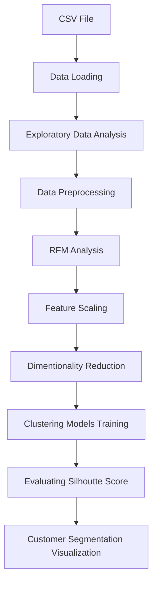

#  📚 E-Commerce Customer Segmentation and Prediction

[](https://www.python.org/downloads/)
[](https://streamlit.io/)
[](https://code.visualstudio.com/download)

<p align="center">
  
</p>

## 🌟 Project Description

This project aims to enhance marketing strategies and customer retention for an e-commerce company by gaining a deeper understanding of their customer base based on their purchasing pattern.The goal is to develop a robust customer segmentation model and a predictive classifier to categorize customers based on their purchasing patterns, enabling the company to tailor marketing strategies, improve customer retention, and optimize inventory management.

## 🎯 Features
- 📊 Detail (Recency Frequency Monetary) RFM Analysis
- 📈 Analyzing Different Models
- ⚙️ Customer Segmentation App

## 🛠️ Technical Architecture

### Component Stack


### 📄 Project Workflow

1. **Dataset Upload**
   - Support 0.5M Rows
   - Multiple Features
   - Helps to do Feature Engieering

2. **Exploratory Data Analysis**
   - Statistical Analysis
   - Univariate Analysis
   - Bivariate Analysis 

3. **Feature Engineering**
   - Create New Features for Machine Learning models
   - Features are Recency Frequency & Monetary
   - Helps to analyze RFM Analysis 
   

4. **Machine Selection & Training**
   - Apply Unsupervised Learning Models
   - Analyze Different Models and Finalize one of them
  
5. **Model Evaluation & Prediction**
   - Evaluating Silhoutte Score
   - Customer Segmentation Visualization 


## 🚀 App Activation & Library installation

### Environment Setup

```bash
# Create virtual environment
python -m venv venv

# Activate environment
# For Windows
.\venv\Scripts\activate

# Install dependencies
pip install -r requirements.txt
```

## 💻 Application Launch
```bash
streamlit run app.py
```

## 👥 **Customer Segmentation App Output**

   <p align="center">
    
  </p>
 
## 🙏 Acknowledgments

- Google Colab
- Streamlit Community
- Visual Studio Code
  
## 💻 Technologies Used

- Python Programming Language
- Scikit Learn Library
- Pandas Library
- NumPy Library
- Seaborn Library
- Matplotlib Library

## 📞 Contact
Feel free to reach out: [Email](mailto:isaad1066@gmail.com) | [LinkedIn](https://www.linkedin.com/in/saadkhalid123/) 
